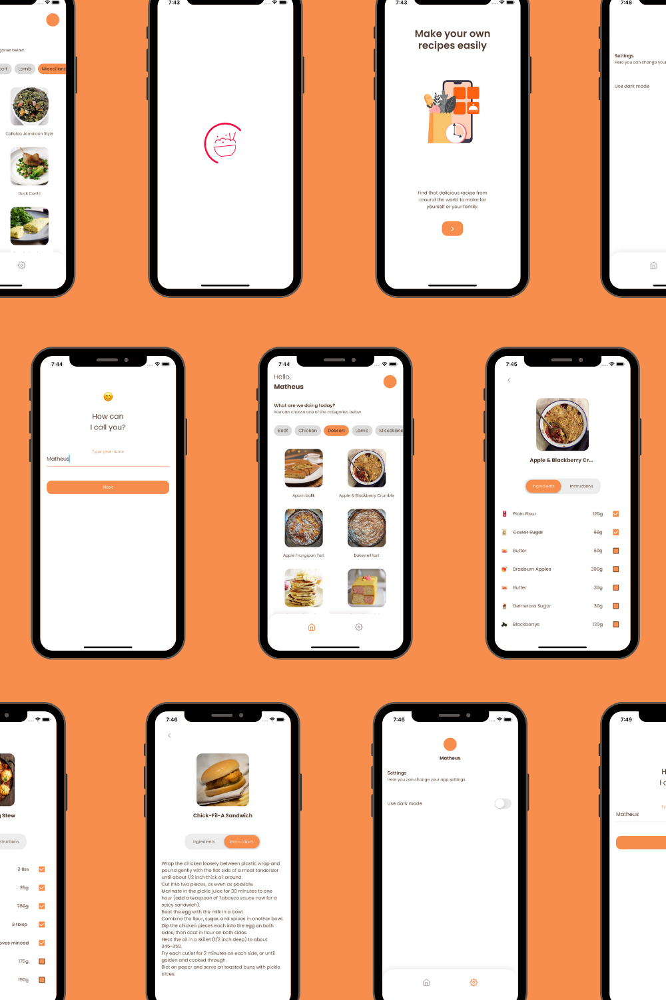
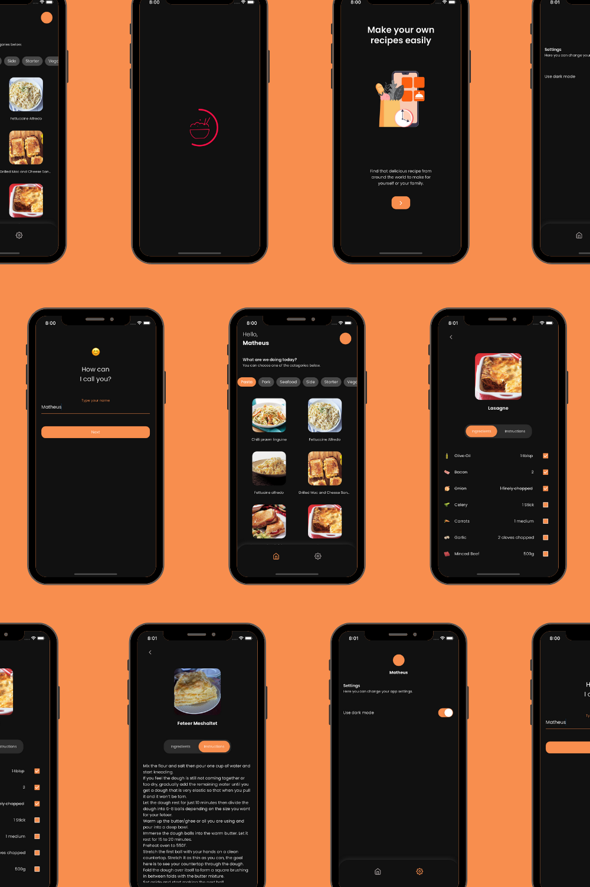

# Cooking Recipes App 🧑‍🍳

O Cooking Recipes é um aplicativo para quem gosta de cozinhar e quer ter receitas incríveis na palma da sua mão! O aplicativo possui uma interface simples e intuitiva, onde você poderá acessar um grande catálogo de receitas de maneira organizada, separadas por categorias. Todas receitas possuem seus respectivos ingredientes e passo a passo do modo de preparo. 

<table>
    <tr>
        <td></td>
        <td></td>
    </tr>
</table>

## Índice

* [Como executar o aplicativo?](#como-executar-o-aplicativo?)
* [Quais são as funcionalidades do aplicativo?](#quais-são-as-funcionalidades-do-aplicativo?)
* [Quais são as tecnologias e recursos utilizados pelo aplicativo?](#quais-são-as-tecnologias-e-recursos-utilizados-pelo-aplicativo?)
* [Quais são as próximas evoluções do aplicativo? ](#quais-são-as-próximas-evoluções-do-aplicativo?)


## Como executar o aplicativo? 🧑‍💻

Primeiramente, é necessário ter o SDK do Flutter (>= 3.1.0) instalado em sua máquina.

Após isso, é só seguir os passos descritos abaixo: 

```bash
## Clone o repositório
$ git clone https://github.com/Matheeusb/cooking_recipes_app

## Acesse a pasta raiz do projeto
$ cd cooking_recipes_app

## Instale as dependências do projeto
$ flutter pub get

## Execute o aplicativo
$ flutter run
```

Para executar os testes unitários, basta executar o comando abaixo na pasta raiz do projeto

```bash
$ flutter test
```

## Quais são as funcionalidades do aplicativo? 📱

- Acesso a diversas categorias de receitas
- Acesso ao catálogo enorme de receitas, separadas por categorias
- Acesso aos detalhes de cada receita, como ingredientes e modo de fazer
- Possibilidade de alternar entre o modo claro e escuro no tema do aplicativo 

## Quais são as tecnologias e recursos utilizados pelo aplicativo? 🛠️

- API [The Meal DB](https://www.themealdb.com/)
- Flutter versão 3.x
- Arquitetura baseada nas camadas propostas pelo Clean Architecture
- Gerenciamento de estados utilizando o Mobx
- Requisições HTTP utilizando o Dio
- Injeção de dependências utilizando o GetIt
- CI utilizando Github Actions (build, analyze e tests)
- Package para gerenciamento de componentes, tokens e temas de forma independente(cooking_recipes_components)

## Quais são as próximas evoluções do aplicativo? 🚀

- Internacionalização dos textos (l10n)
- Salvar seleção de tema localmente (Ex.: SharedPreferences, Hive)
- Estratégia de cache para reduzir o número de requisições
- Compartilhar receitas (Ex.: SharePlus)
- Evolução do package cooking_recipes_components (demais componentes, tokens e testes)